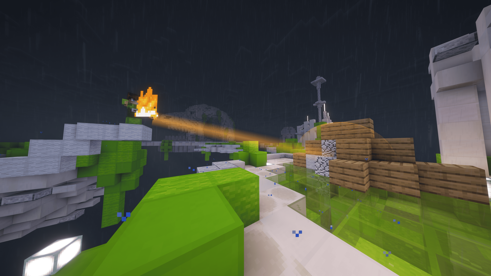

# Fireball Predictor

A client-side Fabric mod for Minecraft 1.21.11 that visualizes the trajectory and impact of fireballs and wither skulls in real-time.



## What it does

Fireball Predictor calculates exactly where explosive projectiles will land and what damage they will do before they hit. 

By syncing explosion power from the server to the client, the mod deterministically simulates the projectile's kinematics and replicates vanilla Minecraft's explosion raycasting algorithm. The result is a highly accurate, real-time prediction rendered directly in the world.

## Features

- **Trajectory Ribbon:** A translucent trail showing the projectile's calculated flight path, accounting for drag and gravity.
- **Shockwave Dome:** Visualizes the predicted explosion radius at the exact point of impact.
- **Block Highlights:** Highlights the specific blocks that will be destroyed by the explosion.
- **Configurable:** Tweak visual settings and behavior through an in-game YetAnotherConfigLib (YACL) menu.

## Fair Play
Some servers might classify this mod as Extra-Sensory Perception (ESP), which is a bannable offense on competitive networks. Always play fair and only use this mod on servers where it is explicitly allowed.

## Setup & Build Instructions

This mod requires **Java 21** and uses the Gradle toolchain.

```bash
# Build the mod
./gradlew build

# Run the client development environment
./gradlew runClient

# Run the server development environment
./gradlew runServer

# Run the automated GameTest suite
./gradlew runGameTest
```

Consult the [/docs](docs) directory for more technical details.

## Publishing a New Release

To publish a new version to **Modrinth**, **CurseForge**, and **GitHub Releases**:

1. Update `mod_version` in [gradle.properties](gradle.properties) and add the version release notes under [CHANGELOG.md](CHANGELOG.md).
2. Commit and push a release tag matching `v*`:
   ```bash
   git commit -am "Prepare release v1.3.0"
   git tag v1.3.0
   git push origin v1.3.0
   ```
The GitHub Actions workflow will automatically build the mod and publish the binary and changelog to Modrinth, CurseForge, and GitHub Releases.

