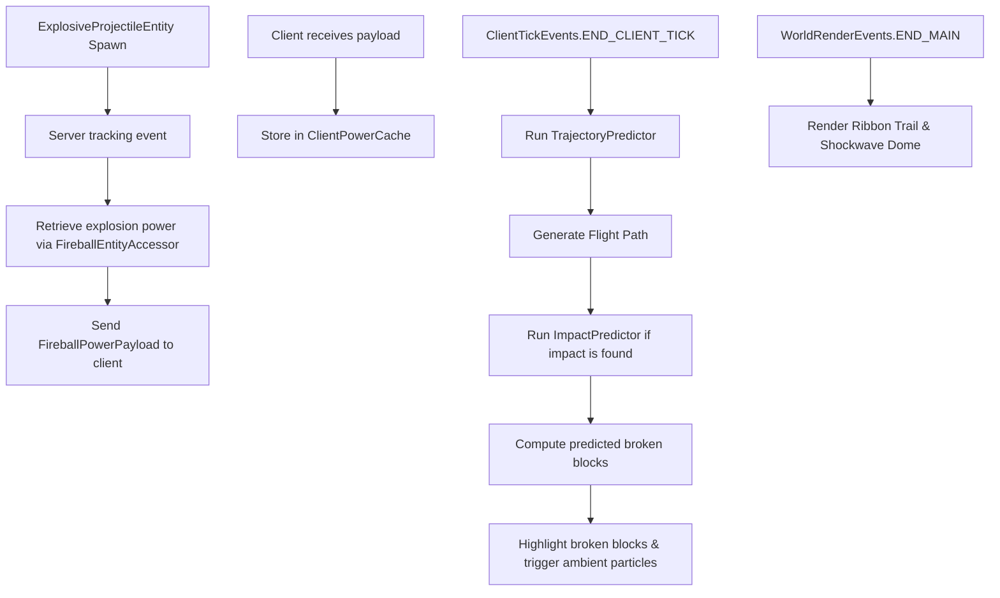

# Fireball Predictor Mod - Agent Documentation

This file serves as a reference for AI coding agents and human developers working on the `Fireball Predictor` Minecraft mod. It describes the project structure, history, configuration, and developer environment.

## Project Overview

`Fireball Predictor` is a Minecraft Fabric mod built on Minecraft **1.21.11** that predicts and visualizes the trajectory and explosion impact of fireballs (and wither skulls) in real-time, client-side.

### Architecture Flow

---

## File Directory Map

Here are the key source files and resources in the project:

### 1. Main Entrypoint & Configuration
* [FireballPredictor.java](file:///c:/Users/simon/Documents/Programming/MinecraftModding/FireballPredictor/src/main/java/com/simonconrad/fireballpredictor/FireballPredictor.java): Root server/mod entrypoint. Syncs fireball size/power to clients.
* [ModConfig.java](file:///c:/Users/simon/Documents/Programming/MinecraftModding/FireballPredictor/src/main/java/com/simonconrad/fireballpredictor/config/ModConfig.java): Annotation-based config handling via YetAnotherConfigLib (YACL) v3.

### 2. Client Logic
* [FireballPredictorClient.java](file:///c:/Users/simon/Documents/Programming/MinecraftModding/FireballPredictor/src/main/java/com/simonconrad/fireballpredictor/client/FireballPredictorClient.java): Handles client ticks, updates prediction data, triggers ambient particles, and manages block breaking overlays.
* [ModMenuIntegration.java](file:///c:/Users/simon/Documents/Programming/MinecraftModding/FireballPredictor/src/main/java/com/simonconrad/fireballpredictor/client/compat/ModMenuIntegration.java): Registers the config screen with ModMenu.

### 3. Math & Logic Simulators
* [TrajectoryPredictor.java](file:///c:/Users/simon/Documents/Programming/MinecraftModding/FireballPredictor/src/main/java/com/simonconrad/fireballpredictor/math/TrajectoryPredictor.java): Simulates projectile kinematics, raycasting, and drag.
* [ImpactPredictor.java](file:///c:/Users/simon/Documents/Programming/MinecraftModding/FireballPredictor/src/main/java/com/simonconrad/fireballpredictor/math/ImpactPredictor.java): Replicates the vanilla explosion raycasting algorithm deterministically using custom config multipliers.
* [PredictionData.java](file:///c:/Users/simon/Documents/Programming/MinecraftModding/FireballPredictor/src/main/java/com/simonconrad/fireballpredictor/math/PredictionData.java): Data class encapsulating path, hit result, broken blocks, and initial velocity.

### 4. Networking & Mixins
* [FireballPowerPayload.java](file:///c:/Users/simon/Documents/Programming/MinecraftModding/FireballPredictor/src/main/java/com/simonconrad/fireballpredictor/network/FireballPowerPayload.java): Packet format for syncing fireball explosion power.
* [ClientPowerCache.java](file:///c:/Users/simon/Documents/Programming/MinecraftModding/FireballPredictor/src/main/java/com/simonconrad/fireballpredictor/client/network/ClientPowerCache.java): Caches tracked entity powers client-side.
* [FireballEntityAccessor.java](file:///c:/Users/simon/Documents/Programming/MinecraftModding/FireballPredictor/src/main/java/com/simonconrad/fireballpredictor/mixin/FireballEntityAccessor.java): Mixin accessor to extract `explosionPower` from fireball instances.

### 5. Client Rendering
* [PredictionRenderer.java](file:///c:/Users/simon/Documents/Programming/MinecraftModding/FireballPredictor/src/main/java/com/simonconrad/fireballpredictor/client/render/PredictionRenderer.java): Draws the translucent trajectory ribbon and shockwave dome.

---

## Build and Run Details

* **JDK Target**: Java 21 (configured in [build.gradle](file:///c:/Users/simon/Documents/Programming/MinecraftModding/FireballPredictor/build.gradle) under source and target compatibility, as well as compile release options).
* **Gradle Toolchain**: Uses Gradle 9.6.1 wrapper.
* **Commands**:
  * Build: `.\gradlew build`
  * Run Client: `.\gradlew runClient`
  * Run Server: `.\gradlew runServer`
