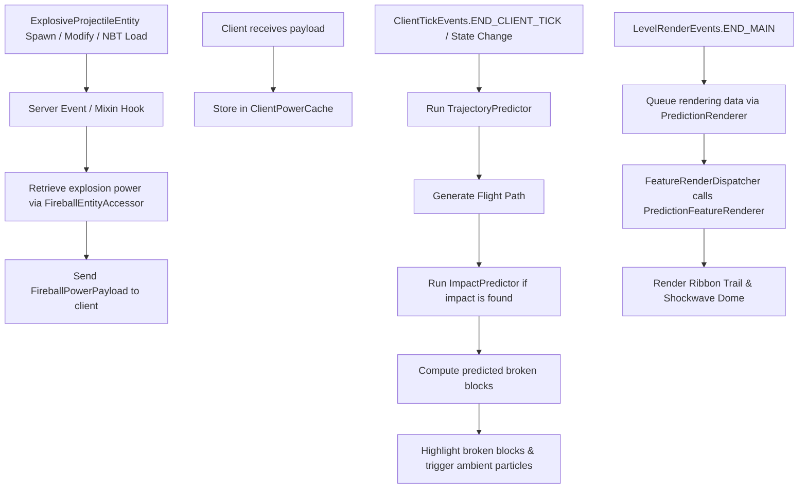

# Fireball Predictor Mod - Agent Documentation

This file serves as a reference for AI coding agents and human developers working on the `Fireball Predictor` Minecraft mod. It describes the project structure, history, configuration, and developer environment.

## Project Overview

`Fireball Predictor` is a Minecraft Fabric mod built on Minecraft **26.2** that predicts and visualizes the trajectory and explosion impact of fireballs (and wither skulls) in real-time, client-side.

### Architecture Flow



---

## File Directory Map

Here are the key source files and resources in the project:

### 1. Main Entrypoint & Configuration
* [FireballPredictor.java](file:///c:/Users/simon/Documents/Programming/MinecraftModding/FireballPredictor/src/main/java/com/simonconrad/fireballpredictor/FireballPredictor.java): Root server/mod entrypoint. Syncs fireball size/power to clients.
* [ModConfig.java](file:///c:/Users/simon/Documents/Programming/MinecraftModding/FireballPredictor/src/main/java/com/simonconrad/fireballpredictor/config/ModConfig.java): Annotation-based config handling via YetAnotherConfigLib (YACL) v3. Configures fireball, wither skull, and wind charge tracking toggles, ribbon/dome colors (including separate white defaults for wind charges), HUD badge settings, ray power multipliers, global fallback fireball power (`globalFallbackFireballPower`), per-server power fallbacks (`serverFallbackPowers`), and dynamic config GUI building via `createScreen`.

### 2. Client Logic
* [FireballPredictorClient.java](file:///c:/Users/simon/Documents/Programming/MinecraftModding/FireballPredictor/src/main/java/com/simonconrad/fireballpredictor/client/FireballPredictorClient.java): Handles client ticks, filters tracked entities (fireballs, wither skulls, wind charges), updates prediction data, triggers ambient particles, manages block breaking overlays, and tracks HUD warning states.
* [ModMenuIntegration.java](file:///c:/Users/simon/Documents/Programming/MinecraftModding/FireballPredictor/src/main/java/com/simonconrad/fireballpredictor/client/compat/ModMenuIntegration.java): Registers the config screen with ModMenu using `ModConfig::createScreen`.

### 3. Math & Logic Simulators
* [TrajectoryPredictor.java](file:///c:/Users/simon/Documents/Programming/MinecraftModding/FireballPredictor/src/main/java/com/simonconrad/fireballpredictor/math/TrajectoryPredictor.java): Simulates projectile kinematics, raycasting, and entity-specific drag (`0.95` for fireballs, `0.73` for charged skulls, `1.0` for wind charges).
* [ImpactPredictor.java](file:///c:/Users/simon/Documents/Programming/MinecraftModding/FireballPredictor/src/main/java/com/simonconrad/fireballpredictor/math/ImpactPredictor.java): Replicates the vanilla explosion raycasting algorithm deterministically using custom config multipliers. Short-circuits block destruction for wind charges (`List.of()`).
* [PredictionData.java](file:///c:/Users/simon/Documents/Programming/MinecraftModding/FireballPredictor/src/main/java/com/simonconrad/fireballpredictor/math/PredictionData.java): Data class encapsulating path, hit result, broken blocks, and initial velocity.

### 4. Networking & Mixins
* [FireballPowerPayload.java](file:///c:/Users/simon/Documents/Programming/MinecraftModding/FireballPredictor/src/main/java/com/simonconrad/fireballpredictor/network/FireballPowerPayload.java): Packet format for syncing fireball explosion power.
* [ClientPowerCache.java](file:///c:/Users/simon/Documents/Programming/MinecraftModding/FireballPredictor/src/main/java/com/simonconrad/fireballpredictor/client/network/ClientPowerCache.java): Caches tracked entity powers client-side.
* [ClientPowerLookup.java](file:///c:/Users/simon/Documents/Programming/MinecraftModding/FireballPredictor/src/main/java/com/simonconrad/fireballpredictor/client/network/ClientPowerLookup.java): 5-tier power resolution router (`POWER_CACHE` -> `inferredPacketRadius` -> `serverFallbackPowers` -> `inferredBlockEstimation` -> `globalFallbackFireballPower`).
* [ExplosionInferenceHandler.java](file:///c:/Users/simon/Documents/Programming/MinecraftModding/FireballPredictor/src/main/java/com/simonconrad/fireballpredictor/client/network/ExplosionInferenceHandler.java): Infers fireball explosion power from incoming `ClientboundExplodePacket` radii (`radius > 0`) or destroyed block distance $d_{\max} / 1.3$ / block count when servers (e.g. Hypixel) zero out explosion radii, retaining session-wide maximum estimation.
* [FireballInferenceTracker.java](file:///c:/Users/simon/Documents/Programming/MinecraftModding/FireballPredictor/src/main/java/com/simonconrad/fireballpredictor/client/network/FireballInferenceTracker.java): Side-safe tracker managing `lastPos` and `hitPos` for fireballs with 3.0-block radius matching and 3000ms record retention. Includes explicit `isFireball` classification.
* [ClientPacketListenerMixin.java](file:///c:/Users/simon/Documents/Programming/MinecraftModding/FireballPredictor/src/main/java/com/simonconrad/fireballpredictor/mixin/ClientPacketListenerMixin.java): Intercepts `ClientboundExplodePacket` on main render thread (`client.isSameThread()`) and delegates to `ExplosionInferenceHandler`.
* [FireballEntityAccessor.java](file:///c:/Users/simon/Documents/Programming/MinecraftModding/FireballPredictor/src/main/java/com/simonconrad/fireballpredictor/FireballEntityAccessor.java): Interface to extract and dynamically set `explosionPower` on fireball instances.
* [LargeFireballMixin.java](file:///c:/Users/simon/Documents/Programming/MinecraftModding/FireballPredictor/src/main/java/com/simonconrad/fireballpredictor/mixin/LargeFireballMixin.java): Mixin implementing `FireballEntityAccessor` to dynamically sync power modifications/NBT loads to tracking clients.

### 5. Client Rendering
* [PredictionRenderer.java](file:///c:/Users/simon/Documents/Programming/MinecraftModding/FireballPredictor/src/main/java/com/simonconrad/fireballpredictor/client/render/PredictionRenderer.java): Draws the translucent trajectory ribbon and shockwave dome with entity-specific colors, as well as the HUD impact warning badge (using `Items.WIND_CHARGE` icon and `#cfd6f7` progress bar for wind charges).

### 6. Automated Testing (GameTest)
* [FireballPredictorGameTest.java](file:///c:/Users/simon/Documents/Programming/MinecraftModding/FireballPredictor/src/main/java/com/simonconrad/fireballpredictor/gametest/FireballPredictorGameTest.java): Regression test suite checking predicted trajectories and block-destruction counts against real in-game detonations across 11 test scenarios. Validates normal fireballs, normal/charged wither skulls, obsidian/waterlogged slab interactions, high-power fireballs, wind charges, and zero-radius explosion power estimation & hierarchy (`testZeroRadiusAffectedBlockEstimationAndHierarchy`).

---

## Build and Run Details

* **JDK Target**: Java 25 (configured in [build.gradle](file:///c:/Users/simon/Documents/Programming/MinecraftModding/FireballPredictor/build.gradle) under source and target compatibility, as well as compile release options).
* **Gradle Toolchain**: Uses Gradle 9.6.1 wrapper.
* **Commands**:
  * Build: `.\gradlew build`
  * Run Client: `.\gradlew runClient`
  * Run Server: `.\gradlew runServer`
  * Run GameTests: `.\gradlew runGameTest`

---

## Fast Class & Method Discovery Workflows

When searching for mapped Minecraft classes, methods, or package paths across version updates (e.g., Fabric Loom / Yarn / Mojang mappings in `~/.gradle/caches/fabric-loom/`):

1. **Native CLI Fast Scan (`tar.exe`)**:
   Windows includes `tar.exe` natively, which inspects ZIP header tables in milliseconds without PowerShell pipeline overhead:
   ```powershell
   tar -tf "C:\Users\simon\.gradle\caches\fabric-loom\26.2\minecraft-merged.jar" | Select-String "WindCharge"
   ```

2. **In-Memory .NET Filtering**:
   If using PowerShell, avoid `ForEach-Object` loops over large ZIP archives. Use direct in-memory `.Where()` filtering to prevent performance bottlenecks:
   ```powershell
   $zip = [System.IO.Compression.ZipFile]::OpenRead('C:\Users\simon\.gradle\caches\fabric-loom\26.2\minecraft-merged.jar')
   $zip.Entries.Where({ $_.FullName -like '*WindCharge*' }).FullName
   $zip.Dispose()
   ```

3. **Decompiled Workspace Sources (`genSources`)**:
   Run `./gradlew genSources` once to generate full decompiled `.java` source JARs (`minecraft-merged-26.2-sources.jar`). This enables direct text and symbol searches across full source files rather than raw `.class` entry names or trial-and-error compilation.

