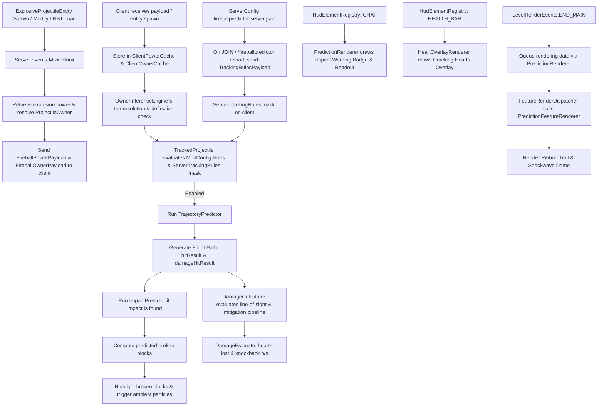

# Fireball Predictor Mod - Agent Documentation

This file serves as a reference for AI coding agents and human developers working on the `Fireball Predictor` Minecraft mod. It describes the project structure, history, configuration, and developer environment.

## Project Overview

`Fireball Predictor` is a Minecraft Fabric mod built on Minecraft **26.2** that predicts and visualizes the trajectory and explosion impact of fireballs (and wither skulls) in real-time, client-side.

### Architecture Flow


```mermaid
graph TD
    A[ExplosiveProjectileEntity Spawn / Modify / NBT Load] --> B[Server Event / Mixin Hook]
    B --> C[Retrieve explosion power & resolve ProjectileOwner]
    C --> D[Send FireballPowerPayload & FireballOwnerPayload to client]
    E[Client receives payload / entity spawn] --> F[Store in ClientPowerCache & ClientOwnerCache]
    F --> G[OwnerInferenceEngine 5-tier resolution & deflection check]
    G --> H[TrackedProjectile evaluates ModConfig filters & ServerTrackingRules mask]
    H -->|Enabled| I[Run TrajectoryPredictor]
    I --> J[Generate Flight Path, hitResult & damageHitResult]
    J --> K[Run ImpactPredictor if impact is found]
    K --> L[Compute predicted broken blocks]
    L --> M[Highlight broken blocks & trigger ambient particles]
    J --> Dmg[DamageCalculator evaluates line-of-sight & mitigation pipeline]
    Dmg --> DmgData[DamageEstimate: hearts lost & knockback b/s]
    N[LevelRenderEvents.END_MAIN] --> O[Queue rendering data via PredictionRenderer]
    O --> P[FeatureRenderDispatcher calls PredictionFeatureRenderer]
    P --> Q[Render Ribbon Trail & Shockwave Dome]
    HudWarn[HudElementRegistry: CHAT] --> WarnBadge[PredictionRenderer draws Impact Warning Badge & Readout]
    HudHearts[HudElementRegistry: HEALTH_BAR] --> HeartsOverlay[HeartOverlayRenderer draws Cracking Hearts Overlay]
    R[ServerConfig fireballpredictor-server.json] --> S[On JOIN / /fireballpredictor reload: send TrackingRulesPayload]
    S --> T[ServerTrackingRules mask on client]
    T --> H
```

---

## File Directory Map

Here are the key source files and resources in the project:

### 1. Main Entrypoint & Configuration
* [FireballPredictor.java](src/main/java/com/simonconrad/fireballpredictor/FireballPredictor.java): Root server/mod entrypoint. Syncs fireball size/power (`FireballPowerPayload`) and authoritative owner info (`FireballOwnerPayload`) to clients. Pushes server tracking restrictions (`TrackingRulesPayload` from `ServerConfig.disabledOwnerMask()`) to players on join and registers `/fireballpredictor reload` (game-master permission) to reload the server config and re-broadcast restrictions live.
* [ModConfig.java](src/main/java/com/simonconrad/fireballpredictor/config/ModConfig.java): Annotation-based config handling via YetAnotherConfigLib (YACL) v3. Configures owner-based projectile tracking (global `@MasterTickBox` + mob master + per-source filters), fireball/wither/wind toggles, ribbon/dome colors (including separate white defaults for wind charges), global fallback fireball power (`globalFallbackFireballPower`), per-server power fallbacks (`serverFallbackPowers`), dynamic config GUI building via `createScreen`, HUD badge settings, damage heart overlay toggles (`renderDamageHeartsOverlay`), damage/knockback readout (`showKnockbackEstimator`), and ray power multipliers. (See [yacl3.md](docs/yacl3.md) for full YACL v3 navigation guide).
* [ServerConfig.java](src/main/java/com/simonconrad/fireballpredictor/config/ServerConfig.java): Dedicated-server-safe (plain Gson, no YACL/client classes) config at `config/fireballpredictor-server.json`. Lets server owners disable prediction tracking for the "other" owner category — master switch `disableOtherOwnerTracking` (whole group) or sub-options `disablePlayerTracking`, `disableDispenserTracking`, `disableCommandTracking` — and computes the `TrackingRules` bitmask broadcast to clients.
* [TrackingRules.java](src/main/java/com/simonconrad/fireballpredictor/tracking/TrackingRules.java): Side-agnostic bitmask model (`PLAYER`, `DISPENSER`, `COMMAND`, `OTHER_GROUP`) mapping `ProjectileOwner` values to restriction bits (`UNKNOWN` folds into `COMMAND`, mirroring the client config mapping).
* [VisualTheme.java](src/main/java/com/simonconrad/fireballpredictor/config/VisualTheme.java): Enum of 16 visual render themes (`DEFAULT`, `RAINBOW`, `CYBERPUNK`, `MATRIX`, `INFERNO`, `HEATMAP`, `CELESTIAL`, `GHOST`, `SCULK_VOID`, `ELECTRIC_ARC`, `TACTICAL_HUD`, `AURORA`, `SINGULARITY`, `SAKURA`, `CRYSTAL`, `ARCADE`) featuring zero-allocation bit-packed color math and precomputed LUTs.
* [TrajectoryStyle.java](src/main/java/com/simonconrad/fireballpredictor/config/TrajectoryStyle.java): Enum configuring ribbon render modes (`SOLID`, `DASHED`, `CORE_ONLY`).
* [ImpactWarningBadgeAnchor.java](src/main/java/com/simonconrad/fireballpredictor/config/ImpactWarningBadgeAnchor.java): Enum controlling HUD warning badge screen anchor alignment (`TOP_LEFT`, `TOP_CENTER`, `TOP_RIGHT`, `BOTTOM_LEFT`, `BOTTOM_CENTER`, `BOTTOM_RIGHT`).

### 2. Client Logic
* [FireballPredictorClient.java](src/main/java/com/simonconrad/fireballpredictor/client/FireballPredictorClient.java): Handles client ticks, owner-filtered tracking (fireballs, wither skulls, wind charges), updates prediction data, triggers ambient particles, manages block breaking overlays using reusable buffers to eliminate per-tick allocations, evaluates player threat levels (`isThreateningPlayer`), ranks incoming threats (tie-breaking equal damage by knockback velocity) to compute `currentDamageEstimate`, and registers HUD rendering hooks (`VanillaHudElements.CHAT` for impact warning badge and `VanillaHudElements.HEALTH_BAR` for cracking hearts) along with client resource reload listeners for preview caching.
* [TrackedProjectile.java](src/main/java/com/simonconrad/fireballpredictor/client/tracking/TrackedProjectile.java): Per-entity prediction tracking container. Evaluates `ModConfig` owner/type filters and `ServerTrackingRules` restriction masks, tracks cached power / charging states to invalidate predictions, guards async recalculations with `isCalculating`, and manages bounding box lifecycles.
* [ProjectileOwner.java](src/main/java/com/simonconrad/fireballpredictor/tracking/ProjectileOwner.java): Enum of inferred projectile origins (`BLAZE`, `GHAST`, `ENDER_DRAGON`, `WITHER`, `PLAYER`, `DISPENSER`, `COMMAND`, `UNKNOWN`).
* [OwnerClassifier.java](src/main/java/com/simonconrad/fireballpredictor/tracking/OwnerClassifier.java): Side-agnostic entity→owner classification and dispenser adjacency shared by server sync and client inference.
* [OwnerInferenceEngine.java](src/main/java/com/simonconrad/fireballpredictor/client/tracking/OwnerInferenceEngine.java): Client five-tier owner inference (`NATIVE_NBT` → `SERVER_PACKET` → `ENVIRONMENTAL_SWEEP` → `DISPENSER_FALLBACK` → `UNKNOWN`/`COMMAND`) plus deflection re-attribution.
* [ServerTrackingRules.java](src/main/java/com/simonconrad/fireballpredictor/client/tracking/ServerTrackingRules.java): Client store of the active server's restriction mask, updated by `TrackingRulesPayload`; cleared on disconnect (`clear()`) so restrictions never leak between servers. Core mask accessors contain no client networking dependencies so they can be loaded safely in server or headless environments.
* [ClientOwnerCache.java](src/main/java/com/simonconrad/fireballpredictor/client/tracking/ClientOwnerCache.java): Client cache for `FireballOwnerPayload` with update listener for in-flight upgrades. Pure cache storage kept side-safe from client networking types; cleared on disconnect.
* [ClientOwnerCacheReceiver.java](src/main/java/com/simonconrad/fireballpredictor/client/tracking/ClientOwnerCacheReceiver.java): `@Environment(EnvType.CLIENT)` receiver registering packet listeners and disconnect events (`ClientPlayConnectionEvents.DISCONNECT`) for `ClientOwnerCache`.
* [ServerTrackingRulesReceiver.java](src/main/java/com/simonconrad/fireballpredictor/client/tracking/ServerTrackingRulesReceiver.java): `@Environment(EnvType.CLIENT)` receiver registering packet listeners and disconnect events (`ClientPlayConnectionEvents.DISCONNECT`) for `ServerTrackingRules`.
* [InferenceResult.java](src/main/java/com/simonconrad/fireballpredictor/client/tracking/InferenceResult.java): Record bundling `ProjectileOwner`, optional owner entity, and `InferenceSource` tier.
* [FireballOwnerPayload.java](src/main/java/com/simonconrad/fireballpredictor/network/FireballOwnerPayload.java): Server→client packet syncing owner type ordinal + owner entity id.
* [TrackingRulesPayload.java](src/main/java/com/simonconrad/fireballpredictor/network/TrackingRulesPayload.java): Server→client packet pushing the disabled "other" owner bitmask (`TrackingRules`) to clients on join and after server config reloads.
* [ModMenuIntegration.java](src/main/java/com/simonconrad/fireballpredictor/client/compat/ModMenuIntegration.java): Registers the config screen with ModMenu using `ModConfig::createScreen`.

### 3. Math & Logic Simulators
* [TrajectoryPredictor.java](src/main/java/com/simonconrad/fireballpredictor/math/TrajectoryPredictor.java): Simulates projectile kinematics, raycasting, and entity-specific drag (`0.95` for fireballs in air, `0.73` for charged skulls in air, `0.8` for fireballs/skulls in water, `1.0` for wind charges). Distinguishes visual world collision (`hitResult` which continues past entities to display full paths on terrain) from entity collision (`damageHitResult`). Evaluates `canHitEntity` using `ProjectileAccessor` and provides `findDamageHitResult` to dynamically detect moving entities intersecting the remaining flight path on each tick.
* [DamageCalculator.java](src/main/java/com/simonconrad/fireballpredictor/math/DamageCalculator.java): Client-safe simulation of Minecraft 26.2's explosion damage and knockback calculation. Evaluates deterministic line-of-sight exposure (`getSeenPercent`), direct hit damage additions (6.0 for Large Fireballs, 5.0 for Small Fireballs, 8.0 for Wither Skulls), difficulty scaling, armor absorption (`CombatRules.getDamageAfterAbsorb`), Resistance effects, and client-side EPF computation (`getEnchantmentProtection` evaluating `EnchantmentEffectComponents.DAMAGE_PROTECTION` with `CompositeLootItemConditionAccessor`), plus knockback impulse magnitude (`computeKnockback`).
* [ImpactPredictor.java](src/main/java/com/simonconrad/fireballpredictor/math/ImpactPredictor.java): Replicates the vanilla explosion raycasting algorithm deterministically using custom config multipliers across 1352 outer boundary rays ($16^3 - 14^3$). Short-circuits block destruction for wind charges (`List.of()`). Handles `WitherBoss.canDestroy` blast-resistance capping (`0.8F`) for charged wither skulls.
* [PredictionData.java](src/main/java/com/simonconrad/fireballpredictor/math/PredictionData.java): Data class encapsulating path, visual hit result, damage hit result, broken blocks, initial velocity, render mesh data, and prediction age.
* [BlockStateSnapshot.java](src/main/java/com/simonconrad/fireballpredictor/math/BlockStateSnapshot.java): Thread-safe local snapshot of block and fluid states captured on the main thread for background worker raycasting.
* [PredictionRenderData.java](src/main/java/com/simonconrad/fireballpredictor/math/PredictionRenderData.java): Data container for pre-computed procedural dome mesh quads.

### 4. Networking & Mixins
* [FireballPowerPayload.java](src/main/java/com/simonconrad/fireballpredictor/network/FireballPowerPayload.java): Packet format for syncing fireball explosion power.
* [ClientPowerCache.java](src/main/java/com/simonconrad/fireballpredictor/client/network/ClientPowerCache.java): Caches tracked entity powers client-side.
* [ClientPowerCacheReceiver.java](src/main/java/com/simonconrad/fireballpredictor/client/network/ClientPowerCacheReceiver.java): `@Environment(EnvType.CLIENT)` receiver registering packet listeners for `ClientPowerCache`.
* [ClientPowerLookup.java](src/main/java/com/simonconrad/fireballpredictor/client/network/ClientPowerLookup.java): 5-tier power resolution router (`POWER_CACHE` -> `serverFallbackPowers` -> `inferredPacketRadius` -> `inferredBlockEstimation` -> `globalFallbackFireballPower`).
* [ExplosionInferenceHandler.java](src/main/java/com/simonconrad/fireballpredictor/client/network/ExplosionInferenceHandler.java): Infers fireball explosion power from incoming `ClientboundExplodePacket` radii (`radius > 0`, with sanity checking against block destruction count/spatial spread) or destroyed block distance $d_{\max} / 1.3$ / block count when servers (e.g. Hypixel) zero out explosion radii or send inflated packet radii, retaining session-wide maximum estimation.
* [FireballInferenceTracker.java](src/main/java/com/simonconrad/fireballpredictor/client/network/FireballInferenceTracker.java): Side-safe tracker managing `lastPos` and `hitPos` for fireballs with 3.0-block radius matching and 3000ms record retention. Includes explicit `isFireball` classification.
* [ClientPacketListenerMixin.java](src/main/java/com/simonconrad/fireballpredictor/mixin/ClientPacketListenerMixin.java): Intercepts `ClientboundExplodePacket` on main render thread (`client.isSameThread()`) and delegates to `ExplosionInferenceHandler`.
* [ClientWorldEntityTracker.java](src/main/java/com/simonconrad/fireballpredictor/mixin/ClientWorldEntityTracker.java): Intercepts `ClientLevel.addEntity` and `removeEntity` calls to register/unregister tracked projectile entities automatically.
* [CompositeLootItemConditionAccessor.java](src/main/java/com/simonconrad/fireballpredictor/mixin/CompositeLootItemConditionAccessor.java): Mixin accessor for `CompositeLootItemCondition.terms`, enabling recursive inspection of `AllOfCondition` and `AnyOfCondition` predicate terms for client-side enchantment protection calculations.
* [ProjectileAccessor.java](src/main/java/com/simonconrad/fireballpredictor/mixin/ProjectileAccessor.java): Mixin invoker exposing protected `Projectile.canHitEntity(Entity)` for client trajectory entity collision filtering.
* [FireballEntityAccessor.java](src/main/java/com/simonconrad/fireballpredictor/FireballEntityAccessor.java): Interface to extract and dynamically set `explosionPower` on fireball instances.
* [LargeFireballMixin.java](src/main/java/com/simonconrad/fireballpredictor/mixin/LargeFireballMixin.java): Mixin implementing `FireballEntityAccessor` to dynamically sync power modifications/NBT loads to tracking clients.

### 5. Client Rendering & Compatibility
* [PredictionPipelines.java](src/main/java/com/simonconrad/fireballpredictor/client/render/PredictionPipelines.java): Registers the mod-owned `PREDICTION` `RenderPipeline` (built from `DEBUG_FILLED_SNIPPET` with `POSITION_COLOR` format, `TRANSLUCENT` blend, `GREATER_THAN_OR_EQUAL` depth test, `depthWrite = false`, and `withCull(false)`).
* [IrisCompat.java](src/main/java/com/simonconrad/fireballpredictor/client/compat/IrisCompat.java): Soft-loaded Iris compatibility layer that registers `PredictionPipelines.PREDICTION` with `ShaderKey.LIGHTNING` via reflection (falling back to public `IrisProgram.BASIC`) so shader packs render the overlay fullbright without dark shading, jagged alpha discards, or depth conflict with block break overlays.
* [PredictionRenderer.java](src/main/java/com/simonconrad/fireballpredictor/client/render/PredictionRenderer.java): Draws the translucent trajectory ribbon and shockwave dome using `PredictionPipelines.PREDICTION` with entity-specific colors and visual theme overrides, as well as the HUD impact warning badge (supporting fireballs, wither skulls, wind charges, and dragon fireballs via `WarningProjectileType`). Provides `impactBadgePosition` to align HUD readouts.
* [PredictionFeatureRenderer.java](src/main/java/com/simonconrad/fireballpredictor/client/render/PredictionFeatureRenderer.java): Feature renderer emitting standard 3D trajectory ribbons (outer shroud + inner core) and procedural Fresnel shockwave domes. Delegates theme passes and overlays to `PredictionThemeRenderer`.
* [PredictionThemeRenderer.java](src/main/java/com/simonconrad/fireballpredictor/client/render/PredictionThemeRenderer.java): Handles all 3D world-space visual theme passes, animated particle/glyph overlays, and procedural geometry generation (lightning arcs, soul tendrils, flames, code rain, black hole accretion disk/void, cherry blossoms, arcade sprites, fighter jets).
* [ThemeVisualAssets.java](src/main/java/com/simonconrad/fireballpredictor/client/render/ThemeVisualAssets.java): Shared immutable bitmap assets, font glyph bitmasks (`MATRIX_GLYPHS`), and arcade sprite palettes (`ARCADE_SPRITES`, `ARCADE_SPRITE_COLORS`) shared across 3D rendering and 2D previews.
* [HeartOverlayRenderer.java](src/main/java/com/simonconrad/fireballpredictor/client/render/HeartOverlayRenderer.java): Draws the "cracking fireball hearts" overlay on top of the vanilla health bar via `HudElementRegistry.attachElementAfter(VanillaHudElements.HEALTH_BAR, ...)`. Allocates damage to absorption first and then current health, rendering half-heart slots with cracking and blinking textures (`cracking_full`, `cracking_half`, `cracking_half_right`). Also renders the text damage/knockback readout (`-X.X❤  ⚡Y.Yb/s`) positioned relative to the impact badge, supporting zero-damage knockback display.
* [WarningProjectileType.java](src/main/java/com/simonconrad/fireballpredictor/client/render/WarningProjectileType.java): Enum modeling projectile categories for the HUD impact warning badge (`FIREBALL` with `Items.FIRE_CHARGE`, `WITHER_SKULL` with `Items.WITHER_SKELETON_SKULL`, `WIND_CHARGE` with `Items.WIND_CHARGE`, and `DRAGON_FIREBALL` with `textures/entity/enderdragon/dragon_fireball.png`) alongside themed progress bar colors (including purple for dragon fireballs).
* [ThemePreviewGallery.java](src/main/java/com/simonconrad/fireballpredictor/client/render/ThemePreviewGallery.java): In-game interactive gallery (`/fppreview` and `/fireballpredictor preview`, or config screen button) that spawns all visual themes simultaneously in a circular exhibition around the player with trajectory flight ribbons and animated shockwave blast domes in 3D world space.
* [ModConfigGui.java](src/main/java/com/simonconrad/fireballpredictor/client/gui/ModConfigGui.java): Custom YACL3 GUI generator constructing the configuration screen with group collapsing, server restriction availability masks, visual theme dropdown selection with 3D preview gallery trigger button, and dynamic option availability disabling for color options overridden by non-default visual themes.
* [FeatureRenderDispatcherMixin.java](src/main/java/com/simonconrad/fireballpredictor/mixin/FeatureRenderDispatcherMixin.java): Mixin registering `PredictionFeatureRenderer` with Minecraft's `FeatureRenderDispatcher`.
* [ConfigPreviewRenderer.java](src/main/java/com/simonconrad/fireballpredictor/client/gui/preview/ConfigPreviewRenderer.java): YACL3 `ImageRenderer` SPI implementation that draws live 2D schematic previews in the config description side panel. Bound via `@CustomImage(factory = …)` on visual options; each frame reads related options' `pendingValue()` through `OptionAccess` so ribbon/dome/HUD edits update immediately.
* Modular Preview Rendering Pipeline (`com.simonconrad.fireballpredictor.client.gui.preview`):
  - [Painter.java](src/main/java/com/simonconrad/fireballpredictor/client/gui/preview/Painter.java): Clipping and drawing primitive wrapper for GUI graphics context.
  - [Arc.java](src/main/java/com/simonconrad/fireballpredictor/client/gui/preview/Arc.java): Quadratic/cubic bezier arc utility for schematic trajectory curves.
  - [TrajectoryRenderer.java](src/main/java/com/simonconrad/fireballpredictor/client/gui/preview/TrajectoryRenderer.java): Draws animated 2D trajectory path with width, color, pulse, core glow, style (`SOLID`/`DASHED`/`CORE_ONLY`), and delegates active `VisualTheme` overlays to `PreviewThemeDecorations`.
  - [ShockwaveRenderer.java](src/main/java/com/simonconrad/fireballpredictor/client/gui/preview/ShockwaveRenderer.java): Draws animated 3x3 block grid, shockwave dome disc via banded horizontal scanlines, Fresnel rim shading, crack overlays, and delegates active `VisualTheme` overlays to `PreviewThemeDecorations`.
  - [PreviewThemeDecorations.java](src/main/java/com/simonconrad/fireballpredictor/client/gui/preview/PreviewThemeDecorations.java): Renders theme-specific 2D trajectory and dome overlays (arcs, tendrils, flames, code rain, radar sweeps, blossoms, arcade sprites) and 2D drawing primitives.
  - [HudRenderer.java](src/main/java/com/simonconrad/fireballpredictor/client/gui/preview/HudRenderer.java): Draws miniature screen frame showing HUD anchor position, X/Y pixel offsets, and dynamic progress bar.
  - [DamageEstimatorRenderer.java](src/main/java/com/simonconrad/fireballpredictor/client/gui/preview/DamageEstimatorRenderer.java): Renders animated cracking damage hearts on a 10-heart health bar with rising fiery embers, and the impact badge with damage/knockback readout.
  - [TrackingRenderer.java](src/main/java/com/simonconrad/fireballpredictor/client/gui/preview/TrackingRenderer.java): Helper renderer drawing master chip overviews, mob-master chip overviews, and single target lock-on badges for the YACL config preview panel.
  - [RenderUtils.java](src/main/java/com/simonconrad/fireballpredictor/client/gui/preview/RenderUtils.java): Color math, interpolation, and alpha blending utilities with dynamic icon texture cache invalidation on resource reload.

### 6. Automated Testing (GameTest)
* [FireballPredictorGameTest.java](src/main/java/com/simonconrad/fireballpredictor/gametest/FireballPredictorGameTest.java): Comprehensive 44-scenario regression test suite checking predicted trajectories, block destruction against real explosions, owner inference, server restriction masks, the visual theme roster, zero-allocation color math pipeline, preview gallery procedural dome meshes, power-cache sentinel handling (server `-1.0f` fallthrough), theme time/color pins (frozen pulse factor, DEFAULT core color), and the full explosion damage estimation pipeline.

### 7. Build & Publishing Infrastructure
* [libs.versions.toml](gradle/libs.versions.toml): Central Gradle version catalog for Minecraft `26.2`, Loom, Fabric API, YACL, ModMenu, and publishing plugins.
* [build.gradle](build.gradle): Configured with `modCompileOnly "maven.modrinth:iris:<version>"` from Terraformers Maven for compile-only Iris API integration.
* [CHANGELOG.md](CHANGELOG.md): Keep a Changelog document parsed automatically by `build.gradle` (`getLatestChangelog()`) to extract version release notes.
* [publish.yml](.github/workflows/publish.yml): GitHub Actions release pipeline triggered on version tags (`v*`) to build and publish to Modrinth, CurseForge, and GitHub Releases.
* [build.yml](.github/workflows/build.yml): Continuous Integration workflow verifying PRs and branch pushes with Gradle action caching.

---

## Build and Run Details

* **JDK Target**: Java 25 (configured in [build.gradle](build.gradle) under source and target compatibility, as well as compile release options).
* **Gradle Toolchain**: Uses Gradle 9.6.1 wrapper.
* **Commands**:
  * Build: `.\gradlew build`
  * Run Client (Vanilla): `.\gradlew runClient`
  * Run Client (Sodium + Iris + Shaders): `.\gradlew runClient -Pshaders` or `.\gradlew runClientWithShaders`
  * Run Server: `.\gradlew runServer`
  * Run GameTests: `.\gradlew runGameTest`
  * Publish Release: `.\gradlew publishMods` (Requires `MODRINTH_TOKEN` & `CURSEFORGE_TOKEN` environment variables)

### Troubleshooting Guidelines
* **Gradle Clean / Output Folder Lock Recovery**: If `.\gradlew clean` or Gradle build tasks fail to clean output directories (e.g., due to Windows file locks on `build/`), do not loop `.\gradlew clean`. Instead, force-delete the build output directory directly (e.g. via `Remove-Item -Recurse -Force build`).

---

## Fast Class & Method Discovery Workflows

When searching for mapped Minecraft classes, methods, or package paths across version updates (e.g., Fabric Loom / Yarn / Mojang mappings in `~/.gradle/caches/fabric-loom/`):

1. **Native CLI Fast Scan (`tar.exe`)**:
   Windows includes `tar.exe` natively, which inspects ZIP header tables in milliseconds without PowerShell pipeline overhead:
   ```powershell
   tar -tf "C:\Users\simon\.gradle\caches\fabric-loom\26.2\minecraft-merged.jar" | Select-String "WindCharge"
   ```

2. **In-Memory .NET Filtering**:
   If using PowerShell, avoid `ForEach-Object` loops over large ZIP archives. Use direct in-memory `.Where()` filtering to prevent performance bottlenecks:
   ```powershell
   $zip = [System.IO.Compression.ZipFile]::OpenRead('C:\Users\simon\.gradle\caches\fabric-loom\26.2\minecraft-merged.jar')
   $zip.Entries.Where({ $_.FullName -like '*WindCharge*' }).FullName
   $zip.Dispose()
   ```

3. **Decompiled Workspace Sources (`genSources`)**:
   Run `./gradlew genSources` once to generate full decompiled `.java` source JARs (`minecraft-merged-26.2-sources.jar`). This enables direct text and symbol searches across full source files rather than raw `.class` entry names or trial-and-error compilation.


