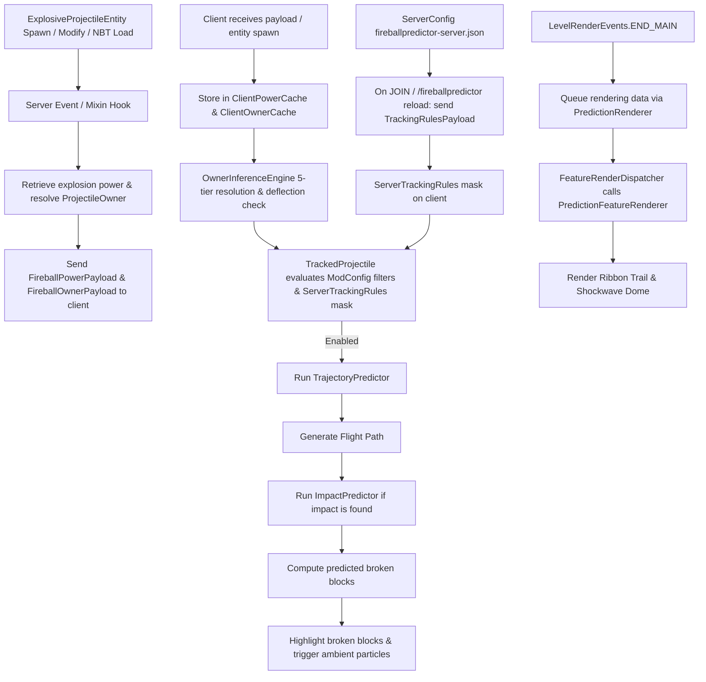

# Fireball Predictor Mod - Agent Documentation

This file serves as a reference for AI coding agents and human developers working on the `Fireball Predictor` Minecraft mod. It describes the project structure, history, configuration, and developer environment.

## Project Overview

`Fireball Predictor` is a Minecraft Fabric mod built on Minecraft **26.2** that predicts and visualizes the trajectory and explosion impact of fireballs (and wither skulls) in real-time, client-side.

### Architecture Flow


```mermaid
graph TD
    A[ExplosiveProjectileEntity Spawn / Modify / NBT Load] --> B[Server Event / Mixin Hook]
    B --> C[Retrieve explosion power & resolve ProjectileOwner]
    C --> D[Send FireballPowerPayload & FireballOwnerPayload to client]
    E[Client receives payload / entity spawn] --> F[Store in ClientPowerCache & ClientOwnerCache]
    F --> G[OwnerInferenceEngine 5-tier resolution & deflection check]
    G --> H[TrackedProjectile evaluates ModConfig filters & ServerTrackingRules mask]
    H -->|Enabled| I[Run TrajectoryPredictor]
    I --> J[Generate Flight Path]
    J --> K[Run ImpactPredictor if impact is found]
    K --> L[Compute predicted broken blocks]
    L --> M[Highlight broken blocks & trigger ambient particles]
    N[LevelRenderEvents.END_MAIN] --> O[Queue rendering data via PredictionRenderer]
    O --> P[FeatureRenderDispatcher calls PredictionFeatureRenderer]
    P --> Q[Render Ribbon Trail & Shockwave Dome]
    R[ServerConfig fireballpredictor-server.json] --> S[On JOIN / /fireballpredictor reload: send TrackingRulesPayload]
    S --> T[ServerTrackingRules mask on client]
    T --> H
```

---

## File Directory Map

Here are the key source files and resources in the project:

### 1. Main Entrypoint & Configuration
* [FireballPredictor.java](src/main/java/com/simonconrad/fireballpredictor/FireballPredictor.java): Root server/mod entrypoint. Syncs fireball size/power (`FireballPowerPayload`) and authoritative owner info (`FireballOwnerPayload`) to clients. Pushes server tracking restrictions (`TrackingRulesPayload` from `ServerConfig.disabledOwnerMask()`) to players on join and registers `/fireballpredictor reload` (game-master permission) to reload the server config and re-broadcast restrictions live.
* [ModConfig.java](src/main/java/com/simonconrad/fireballpredictor/config/ModConfig.java): Annotation-based config handling via YetAnotherConfigLib (YACL) v3. Configures owner-based projectile tracking (global `@MasterTickBox` + mob master + per-source filters), fireball/wither/wind toggles, ribbon/dome colors (including separate white defaults for wind charges), global fallback fireball power (`globalFallbackFireballPower`), per-server power fallbacks (`serverFallbackPowers`), and dynamic config GUI building via `createScreen`, HUD badge settings, and ray power multipliers. (See [yacl3.md](docs/yacl3.md) for full YACL v3 navigation guide).
* [ServerConfig.java](src/main/java/com/simonconrad/fireballpredictor/config/ServerConfig.java): Dedicated-server-safe (plain Gson, no YACL/client classes) config at `config/fireballpredictor-server.json`. Lets server owners disable prediction tracking for the "other" owner category — master switch `disableOtherOwnerTracking` (whole group) or sub-options `disablePlayerTracking`, `disableDispenserTracking`, `disableCommandTracking` — and computes the `TrackingRules` bitmask broadcast to clients.
* [TrackingRules.java](src/main/java/com/simonconrad/fireballpredictor/tracking/TrackingRules.java): Side-agnostic bitmask model (`PLAYER`, `DISPENSER`, `COMMAND`, `OTHER_GROUP`) mapping `ProjectileOwner` values to restriction bits (`UNKNOWN` folds into `COMMAND`, mirroring the client config mapping).
* [TrajectoryStyle.java](src/main/java/com/simonconrad/fireballpredictor/config/TrajectoryStyle.java): Enum configuring ribbon render modes (`SOLID`, `DASHED`, `CORE_ONLY`).
* [ImpactWarningBadgeAnchor.java](src/main/java/com/simonconrad/fireballpredictor/config/ImpactWarningBadgeAnchor.java): Enum controlling HUD warning badge screen anchor alignment (`TOP_LEFT`, `TOP_CENTER`, `TOP_RIGHT`, `BOTTOM_LEFT`, `BOTTOM_CENTER`, `BOTTOM_RIGHT`).

### 2. Client Logic
* [FireballPredictorClient.java](src/main/java/com/simonconrad/fireballpredictor/client/FireballPredictorClient.java): Handles client ticks, owner-filtered tracking (fireballs, wither skulls, wind charges), updates prediction data, triggers ambient particles, manages block breaking overlays, and tracks HUD warning states.
* [ProjectileOwner.java](src/main/java/com/simonconrad/fireballpredictor/tracking/ProjectileOwner.java): Enum of inferred projectile origins (`BLAZE`, `GHAST`, `ENDER_DRAGON`, `WITHER`, `PLAYER`, `DISPENSER`, `COMMAND`, `UNKNOWN`).
* [OwnerClassifier.java](src/main/java/com/simonconrad/fireballpredictor/tracking/OwnerClassifier.java): Side-agnostic entity→owner classification and dispenser adjacency shared by server sync and client inference.
* [OwnerInferenceEngine.java](src/main/java/com/simonconrad/fireballpredictor/client/tracking/OwnerInferenceEngine.java): Client five-tier owner inference (`NATIVE_NBT` → `SERVER_PACKET` → `ENVIRONMENTAL_SWEEP` → `DISPENSER_FALLBACK` → `UNKNOWN`/`COMMAND`) plus deflection re-attribution.
* [ServerTrackingRules.java](src/main/java/com/simonconrad/fireballpredictor/client/tracking/ServerTrackingRules.java): Client store of the active server's restriction mask, updated by `TrackingRulesPayload`; cleared on disconnect so restrictions never leak between servers. Core mask accessors contain no client networking dependencies so they can be loaded safely in server or headless environments.
* [ClientOwnerCache.java](src/main/java/com/simonconrad/fireballpredictor/client/tracking/ClientOwnerCache.java): Client cache for `FireballOwnerPayload` with update listener for in-flight upgrades. Pure cache storage kept side-safe from client networking types.
* [ClientOwnerCacheReceiver.java](src/main/java/com/simonconrad/fireballpredictor/client/tracking/ClientOwnerCacheReceiver.java): `@Environment(EnvType.CLIENT)` receiver registering packet listeners and disconnect events for `ClientOwnerCache`.
* [ServerTrackingRulesReceiver.java](src/main/java/com/simonconrad/fireballpredictor/client/tracking/ServerTrackingRulesReceiver.java): `@Environment(EnvType.CLIENT)` receiver registering packet listeners and disconnect events for `ServerTrackingRules`.
* [InferenceResult.java](src/main/java/com/simonconrad/fireballpredictor/client/tracking/InferenceResult.java): Record bundling `ProjectileOwner`, optional owner entity, and `InferenceSource` tier.
* [FireballOwnerPayload.java](src/main/java/com/simonconrad/fireballpredictor/network/FireballOwnerPayload.java): Server→client packet syncing owner type ordinal + owner entity id.
* [TrackingRulesPayload.java](src/main/java/com/simonconrad/fireballpredictor/network/TrackingRulesPayload.java): Server→client packet pushing the disabled "other" owner bitmask (`TrackingRules`) to clients on join and after server config reloads.
* [ModMenuIntegration.java](src/main/java/com/simonconrad/fireballpredictor/client/compat/ModMenuIntegration.java): Registers the config screen with ModMenu using `ModConfig::createScreen`.

### 3. Math & Logic Simulators
* [TrajectoryPredictor.java](src/main/java/com/simonconrad/fireballpredictor/math/TrajectoryPredictor.java): Simulates projectile kinematics, raycasting, and entity-specific drag (`0.95` for fireballs in air, `0.73` for charged skulls in air, `0.8` for fireballs/skulls in water, `1.0` for wind charges).
* [ImpactPredictor.java](src/main/java/com/simonconrad/fireballpredictor/math/ImpactPredictor.java): Replicates the vanilla explosion raycasting algorithm deterministically using custom config multipliers. Short-circuits block destruction for wind charges (`List.of()`).
* [PredictionData.java](src/main/java/com/simonconrad/fireballpredictor/math/PredictionData.java): Data class encapsulating path, hit result, broken blocks, and initial velocity.
* [BlockStateSnapshot.java](src/main/java/com/simonconrad/fireballpredictor/math/BlockStateSnapshot.java): Thread-safe local snapshot of block and fluid states captured on the main thread for background worker raycasting.
* [PredictionRenderData.java](src/main/java/com/simonconrad/fireballpredictor/math/PredictionRenderData.java): Data container for pre-computed procedural dome mesh quads.

### 4. Networking & Mixins
* [FireballPowerPayload.java](src/main/java/com/simonconrad/fireballpredictor/network/FireballPowerPayload.java): Packet format for syncing fireball explosion power.
* [ClientPowerCache.java](src/main/java/com/simonconrad/fireballpredictor/client/network/ClientPowerCache.java): Caches tracked entity powers client-side.
* [ClientPowerCacheReceiver.java](src/main/java/com/simonconrad/fireballpredictor/client/network/ClientPowerCacheReceiver.java): `@Environment(EnvType.CLIENT)` receiver registering packet listeners for `ClientPowerCache`.
* [ClientPowerLookup.java](src/main/java/com/simonconrad/fireballpredictor/client/network/ClientPowerLookup.java): 5-tier power resolution router (`POWER_CACHE` -> `serverFallbackPowers` -> `inferredPacketRadius` -> `inferredBlockEstimation` -> `globalFallbackFireballPower`).
* [ExplosionInferenceHandler.java](src/main/java/com/simonconrad/fireballpredictor/client/network/ExplosionInferenceHandler.java): Infers fireball explosion power from incoming `ClientboundExplodePacket` radii (`radius > 0`, with sanity checking against block destruction count/spatial spread) or destroyed block distance $d_{\max} / 1.3$ / block count when servers (e.g. Hypixel) zero out explosion radii or send inflated packet radii, retaining session-wide maximum estimation.
* [FireballInferenceTracker.java](src/main/java/com/simonconrad/fireballpredictor/client/network/FireballInferenceTracker.java): Side-safe tracker managing `lastPos` and `hitPos` for fireballs with 3.0-block radius matching and 3000ms record retention. Includes explicit `isFireball` classification.
* [ClientPacketListenerMixin.java](src/main/java/com/simonconrad/fireballpredictor/mixin/ClientPacketListenerMixin.java): Intercepts `ClientboundExplodePacket` on main render thread (`client.isSameThread()`) and delegates to `ExplosionInferenceHandler`.
* [ClientWorldEntityTracker.java](src/main/java/com/simonconrad/fireballpredictor/mixin/ClientWorldEntityTracker.java): Intercepts `ClientLevel.addEntity` and `removeEntity` calls to register/unregister tracked projectile entities automatically.
* [FireballEntityAccessor.java](src/main/java/com/simonconrad/fireballpredictor/FireballEntityAccessor.java): Interface to extract and dynamically set `explosionPower` on fireball instances.
* [LargeFireballMixin.java](src/main/java/com/simonconrad/fireballpredictor/mixin/LargeFireballMixin.java): Mixin implementing `FireballEntityAccessor` to dynamically sync power modifications/NBT loads to tracking clients.

### 5. Client Rendering & Compatibility
* [PredictionPipelines.java](src/main/java/com/simonconrad/fireballpredictor/client/render/PredictionPipelines.java): Registers the mod-owned `PREDICTION` `RenderPipeline` (built from `DEBUG_FILLED_SNIPPET` with `POSITION_COLOR` format, `TRANSLUCENT` blend, `GREATER_THAN_OR_EQUAL` depth test, `depthWrite = false`, and `withCull(false)`).
* [IrisCompat.java](src/main/java/com/simonconrad/fireballpredictor/client/compat/IrisCompat.java): Soft-loaded Iris compatibility layer that registers `PredictionPipelines.PREDICTION` with `ShaderKey.LIGHTNING` via reflection (falling back to public `IrisProgram.BASIC`) so shader packs render the overlay fullbright without dark shading, jagged alpha discards, or depth conflict with block break overlays.
* [PredictionRenderer.java](src/main/java/com/simonconrad/fireballpredictor/client/render/PredictionRenderer.java): Draws the translucent trajectory ribbon and shockwave dome using `PredictionPipelines.PREDICTION` with entity-specific colors, as well as the HUD impact warning badge (using `Items.WIND_CHARGE` icon and `#cfd6f7` progress bar for wind charges).
* [PredictionFeatureRenderer.java](src/main/java/com/simonconrad/fireballpredictor/client/render/PredictionFeatureRenderer.java): Custom `RenderTypeFeatureRenderer` executing `PredictionSubmit` translucent model submits (emitting shockwave dome quads first, ribbon trail second to ensure correct blending).
* [FeatureRenderDispatcherMixin.java](src/main/java/com/simonconrad/fireballpredictor/mixin/FeatureRenderDispatcherMixin.java): Mixin registering `PredictionFeatureRenderer` with Minecraft's `FeatureRenderDispatcher`.
* [ConfigPreviewRenderer.java](src/main/java/com/simonconrad/fireballpredictor/client/gui/preview/ConfigPreviewRenderer.java): YACL3 `ImageRenderer` SPI implementation that draws live 2D schematic previews in the config description side panel. Bound via `@CustomImage(factory = …)` on visual options; each frame reads related options' `pendingValue()` through `OptionAccess` so ribbon/dome/HUD edits update immediately.
  - **Trajectory Preview**: Animated 2D arc reflecting ribbon color, width, style (`SOLID`/`DASHED`/`CORE_ONLY`), core glow, and pulse.
  - **Shockwave Preview**: 3×3 block grid with animated dome disc and optional crack highlights.
  - **HUD Impact Warning Preview**: Miniature screen frame showing badge anchor + X/Y offsets with a live progress bar.
  - **Tracking Previews**: Master/mob-master overview chips + per-source lock-on badges (Blaze, Ghast, Dragon, Wither, Player, Dispenser, Command, Wind).
* [TrackingRenderer.java](src/main/java/com/simonconrad/fireballpredictor/client/gui/preview/TrackingRenderer.java): Helper renderer drawing master chip overviews, mob-master chip overviews, and single target lock-on badges for the YACL config preview panel.

### 6. Automated Testing (GameTest)
* [FireballPredictorGameTest.java](src/main/java/com/simonconrad/fireballpredictor/gametest/FireballPredictorGameTest.java): Regression test suite checking predicted trajectories and block-destruction counts against real in-game detonations, plus owner-inference coverage (`testOwnerInferenceNativeAndSweep`, `testOwnerInferenceDispenserAndDeflection`). Validates normal fireballs, normal/charged wither skulls, obsidian/waterlogged slab interactions, high-power fireballs, wind charges, zero-radius explosion power estimation & hierarchy, and owner filter evaluation. `testServerTrackingRestrictions` covers the server restriction mask (whole group & sub-options, deflection non-bypass, `ServerConfig` mask computation).

### 7. Build & Publishing Infrastructure
* [libs.versions.toml](gradle/libs.versions.toml): Central Gradle version catalog for Minecraft `26.2`, Loom, Fabric API, YACL, ModMenu, and publishing plugins.
* [build.gradle](build.gradle): Configured with `modCompileOnly "maven.modrinth:iris:<version>"` from Terraformers Maven for compile-only Iris API integration.
* [CHANGELOG.md](CHANGELOG.md): Keep a Changelog document parsed automatically by `build.gradle` (`getLatestChangelog()`) to extract version release notes.
* [publish.yml](.github/workflows/publish.yml): GitHub Actions release pipeline triggered on version tags (`v*`) to build and publish to Modrinth, CurseForge, and GitHub Releases.
* [build.yml](.github/workflows/build.yml): Continuous Integration workflow verifying PRs and branch pushes with Gradle action caching.

---

## Build and Run Details

* **JDK Target**: Java 25 (configured in [build.gradle](build.gradle) under source and target compatibility, as well as compile release options).
* **Gradle Toolchain**: Uses Gradle 9.6.1 wrapper.
* **Commands**:
  * Build: `.\gradlew build`
  * Run Client (Vanilla): `.\gradlew runClient`
  * Run Client (Sodium + Iris + Shaders): `.\gradlew runClient -Pshaders` or `.\gradlew runClientWithShaders`
  * Run Server: `.\gradlew runServer`
  * Run GameTests: `.\gradlew runGameTest`
  * Publish Release: `.\gradlew publishMods` (Requires `MODRINTH_TOKEN` & `CURSEFORGE_TOKEN` environment variables)

### Troubleshooting Guidelines
* **Gradle Clean / Output Folder Lock Recovery**: If `.\gradlew clean` or Gradle build tasks fail to clean output directories (e.g., due to Windows file locks on `build/`), do not loop `.\gradlew clean`. Instead, force-delete the build output directory directly (e.g. via `Remove-Item -Recurse -Force build`).

---

## Fast Class & Method Discovery Workflows

When searching for mapped Minecraft classes, methods, or package paths across version updates (e.g., Fabric Loom / Yarn / Mojang mappings in `~/.gradle/caches/fabric-loom/`):

1. **Native CLI Fast Scan (`tar.exe`)**:
   Windows includes `tar.exe` natively, which inspects ZIP header tables in milliseconds without PowerShell pipeline overhead:
   ```powershell
   tar -tf "C:\Users\simon\.gradle\caches\fabric-loom\26.2\minecraft-merged.jar" | Select-String "WindCharge"
   ```

2. **In-Memory .NET Filtering**:
   If using PowerShell, avoid `ForEach-Object` loops over large ZIP archives. Use direct in-memory `.Where()` filtering to prevent performance bottlenecks:
   ```powershell
   $zip = [System.IO.Compression.ZipFile]::OpenRead('C:\Users\simon\.gradle\caches\fabric-loom\26.2\minecraft-merged.jar')
   $zip.Entries.Where({ $_.FullName -like '*WindCharge*' }).FullName
   $zip.Dispose()
   ```

3. **Decompiled Workspace Sources (`genSources`)**:
   Run `./gradlew genSources` once to generate full decompiled `.java` source JARs (`minecraft-merged-26.2-sources.jar`). This enables direct text and symbol searches across full source files rather than raw `.class` entry names or trial-and-error compilation.


